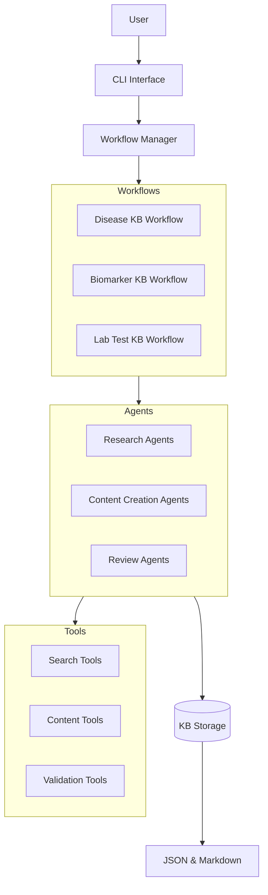

# CrewKB

A knowledge base creation system for biomedical topics using Crew.AI.

## Overview

CrewKB is a system that leverages the Crew.AI framework to create comprehensive, accurate, and structured knowledge base articles on biomedical topics. It uses specialized AI agents that collaborate to research, create, and review articles on health conditions, biomarkers, laboratory tests, and more.



## Features

- **Specialized Agents**: Different agents with specific roles collaborate to create knowledge base articles.
- **Multiple Workflows**: Different workflows for different types of biomedical topics.
- **Structured Content**: Articles follow a consistent structure defined by Pydantic models.
- **Dual Storage Format**: Articles are stored in both JSON (for programmatic access) and Markdown (for human readability).
- **Quality Assurance**: Review agents ensure accuracy and detect potential hallucinations.
- **CLI Interface**: Simple command-line interface for creating and managing articles.

## Installation

### Prerequisites

- Python 3.10 or higher
- uv (for dependency management and virtual environment creation)

### Using uv

```bash
# Install uv if not already installed
curl -sSf https://install.python-poetry.org | python3 -

# Clone the repository
git clone https://github.com/username/CrewKB.git
cd CrewKB

# Create a virtual environment and install dependencies
python -m crewkb.utils.setup
```

### Manual Installation

```bash
# Clone the repository
git clone https://github.com/username/CrewKB.git
cd CrewKB

# Create a virtual environment
python -m venv .venv
source .venv/bin/activate  # On Unix/macOS
# or
.venv\Scripts\activate  # On Windows

# Install dependencies
pip install -e .
```

## Configuration

Create a `.env` file in the project root directory with the following variables:

```
# API Keys
OPENAI_API_KEY=your_openai_api_key
SERPER_API_KEY=your_serper_api_key

# Configuration
LOG_LEVEL=INFO
OUTPUT_DIR=./output
```

## Usage

### Creating a Knowledge Base Article

```bash
crewkb create "Diabetes Mellitus" --type disease
```

### Listing Knowledge Base Articles

```bash
crewkb list
```

### Exporting a Knowledge Base Article

```bash
crewkb export "Diabetes Mellitus" --format markdown --output diabetes.md
```

## Project Structure

```
CrewKB/
├── memory-bank/           # Memory bank files
├── .env                   # Environment variables
├── pyproject.toml         # Project configuration
├── README.md              # Project documentation
├── crewkb/
│   ├── __init__.py
│   ├── cli.py             # CLI interface
│   ├── config.py          # Configuration
│   ├── models/            # Pydantic models
│   ├── agents/            # Agent definitions
│   ├── crews/             # Crew definitions
│   ├── tools/             # Tool implementations
│   ├── storage/           # Storage implementations
│   └── utils/             # Utility functions
└── tests/                 # Test directory
```

## Development

### Setting Up the Development Environment

```bash
# Install development dependencies
pip install -e ".[dev]"
```

### Running Tests

```bash
pytest
```

### Code Formatting

```bash
black crewkb
isort crewkb
```

## License

This project is licensed under the MIT License - see the LICENSE file for details.
