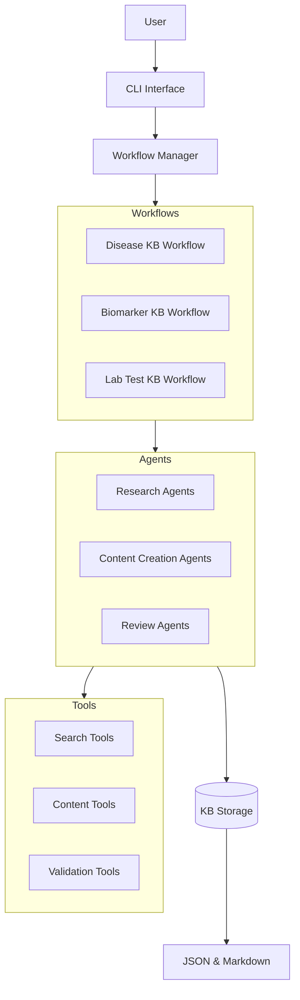

# CrewKB

A knowledge base creation system for biomedical topics using Crew.AI.

## Overview

CrewKB is a system that leverages the Crew.AI framework to create comprehensive, accurate, and structured knowledge base articles on biomedical topics. It uses specialized AI agents that collaborate to research, create, and review articles on health conditions, biomarkers, laboratory tests, and more.



## Features

- **Specialized Agents**: Different agents with specific roles collaborate to create knowledge base articles.
- **Multiple Workflows**: Different workflows for different types of biomedical topics.
- **Structured Content**: Articles follow a consistent structure defined by Pydantic models.
- **Dual Storage Format**: Articles are stored in both JSON (for programmatic access) and Markdown (for human readability).
- **Quality Assurance**: Review agents ensure accuracy and detect potential hallucinations.
- **CLI Interface**: Simple command-line interface for creating and managing articles.
- **Google Gemini Models**: Uses Google's Gemini 2.0 Flash models for high-quality, efficient content generation.

## Installation

### Prerequisites

- Python 3.10 or higher
- uv (for dependency management and virtual environment creation)

### Installing uv

If you don't have uv installed, you can install it using one of the following methods:

```bash
# Using the official installer script
curl -sSf https://astral.sh/uv/install.sh | sh

# Or using pip
pip install uv
```

### Installation Process

```bash
# Clone the repository
git clone https://github.com/username/CrewKB.git
cd CrewKB

# Make the installation script executable
chmod +x install.sh

# Run the installation script
./install.sh
```

The installation script will:
1. Create a virtual environment (.venv)
2. Install all dependencies in the virtual environment
3. Install the package in development mode
4. Create the crewkb command

After installation, you need to activate the virtual environment:

```bash
source .venv/bin/activate  # On Unix/macOS
# or
.venv\Scripts\activate  # On Windows
```

Once activated, you can use the `crewkb` command directly:

```bash
crewkb --help
```

### Troubleshooting

If you encounter issues with the installation:

1. Make sure you have the necessary permissions to execute the script:
   ```bash
   chmod +x install.sh
   ```

2. If you're having issues with API keys, check your .env file:
   ```bash
   cat .env
   ```
   
3. If the installation fails, you can try running it with bash explicitly:
   ```bash
   bash install.sh
   ```

4. To reinstall, simply run the installation script again:
   ```bash
   ./install.sh
   ```

### Cleaning Up Base Environment

If you previously used the old installation script and it polluted your base environment, you can clean it up with:

```bash
pip uninstall -y crewai pydantic typer requests python-dotenv markdown langchain langchain-community langchain-core biopython pytest flake8 black isort
```

## Configuration

Create a `.env` file in the project root directory with the following variables:

```
# API Keys
GEMINI_API_KEY=your_gemini_api_key
SERPER_API_KEY=your_serper_api_key
ENTREZ_EMAIL=your_email@example.com
ENTREZ_API_KEY=your_entrez_api_key

# LLM Configuration
DEFAULT_LLM_MODEL=gemini/gemini-2.0-flash-exp
DEFAULT_LLM_TEMPERATURE=0.7

# Configuration
LOG_LEVEL=INFO
OUTPUT_DIR=./output
```

## Usage

### Researching a Biomedical Topic

```bash
crewkb research "Diabetes Mellitus" --output diabetes_research.md
```

This command will use specialized AI agents to research the topic and synthesize the findings into a comprehensive report.

### Creating a Knowledge Base Article

```bash
crewkb create "Diabetes Mellitus" --type disease
```

### Listing Knowledge Base Articles

```bash
crewkb list
```

### Exporting a Knowledge Base Article

```bash
crewkb export "Diabetes Mellitus" --format markdown --output diabetes.md
```

## Project Structure

```
CrewKB/
├── memory-bank/           # Memory bank files
├── .env                   # Environment variables
├── pyproject.toml         # Project configuration
├── README.md              # Project documentation
├── crewkb/
│   ├── __init__.py
│   ├── cli.py             # CLI interface
│   ├── config.py          # Configuration
│   ├── models/            # Pydantic models
│   ├── agents/            # Agent definitions
│   │   ├── research/      # Research agents
│   │   ├── content/       # Content creation agents
│   │   └── review/        # Review agents
│   ├── crews/             # Crew definitions
│   ├── config/            # YAML configurations
│   │   ├── agents/        # Agent configurations
│   │   └── tasks/         # Task configurations
│   ├── tools/             # Tool implementations
│   │   ├── search/        # Search tools
│   │   ├── content/       # Content tools
│   │   └── validation/    # Validation tools
│   ├── storage/           # Storage implementations
│   └── utils/             # Utility functions
└── tests/                 # Test directory
```

## Development

### Setting Up the Development Environment

```bash
# Install development dependencies
pip install -e ".[dev]"
```

### Running Tests

```bash
pytest
```

### Code Formatting

```bash
black crewkb
isort crewkb
```

## License

This project is licensed under the MIT License - see the LICENSE file for details.
