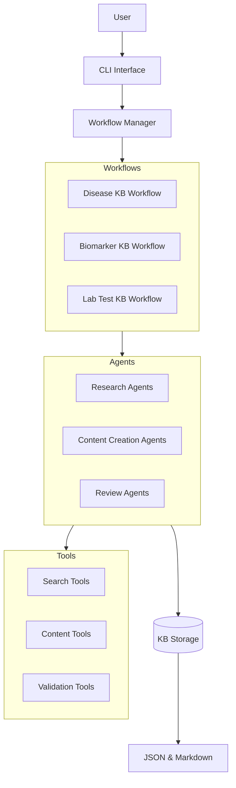

# CrewKB System Patterns

## System Architecture

CrewKB follows a modular, agent-based architecture built on the Crew.AI framework. The system is designed to be flexible, extensible, and capable of handling different types of biomedical knowledge base articles.

## Key Components

### 1. CLI Interface

The command-line interface serves as the primary entry point for users to interact with the CrewKB system. It allows users to:

- Initiate the creation of new knowledge base articles
- Specify topics and article types
- Monitor the progress of article creation
- Access and export completed articles

### 2. Workflow Manager

The Workflow Manager orchestrates the overall process of knowledge base article creation. It:

- Selects the appropriate workflow based on the article type
- Manages the execution of workflows
- Handles transitions between different phases
- Monitors the progress and status of article creation

### 3. Specialized Workflows

CrewKB implements different workflows for various types of biomedical topics:

- **Disease KB Workflow**: Specialized for creating articles about health conditions
- **Biomarker KB Workflow**: Tailored for biomarker-related articles
- **Lab Test KB Workflow**: Designed for articles about laboratory tests

Each workflow defines the sequence of tasks, agent interactions, and specific requirements for its article type.

### 4. Agent System

The agent system consists of specialized AI agents with distinct roles and responsibilities:

#### Research Agents
- **Medical Literature Researcher**: Searches and analyzes scientific literature
- **Clinical Guidelines Analyst**: Identifies and summarizes clinical guidelines
- **Medical Data Synthesizer**: Compiles and organizes research findings

#### Content Creation Agents
- **Medical Content Architect**: Designs article outlines
- **Medical Content Writer**: Transforms research into structured content
- **Medical Citation Specialist**: Manages citations and references

#### Review Agents
- **Medical Accuracy Reviewer**: Verifies scientific accuracy
- **Medical Content Editor**: Ensures quality and adherence to structure
- **Patient Perspective Reviewer**: Evaluates accessibility for non-specialists

### 5. Tool System

The tool system provides specialized capabilities to the agents:

#### Search Tools
- **SerperDevTool**: For Google search
- **PubMedSearchTool**: For searching PubMed
- **ArXivSearchTool**: For searching arXiv
- **SemanticScholarSearchTool**: For searching Semantic Scholar

#### Content Tools
- **OutlineGeneratorTool**: For creating article outlines
- **CitationFormatterTool**: For formatting citations
- **ContentStructureTool**: For structuring content according to templates

#### Validation Tools
- **FactCheckerTool**: For verifying factual accuracy
- **StructureValidatorTool**: For validating article structure
- **HallucinationDetectorTool**: For identifying unsupported claims

### 6. Storage System

The storage system manages the persistence of knowledge base articles:

- **JSON Storage**: Stores articles in structured JSON format
- **Markdown Storage**: Converts articles to Markdown for human readability
- **Version Control**: Maintains article history and revisions

## Design Patterns

### 1. Agent-Based Architecture

CrewKB uses an agent-based architecture where specialized agents collaborate to accomplish complex tasks. This pattern:

- Enables division of labor based on specialized expertise
- Facilitates parallel processing of different aspects of article creation
- Allows for autonomous decision-making within defined roles
- Supports flexible workflows with dynamic task allocation

### 2. Workflow Pattern

The workflow pattern organizes the article creation process into distinct phases with clear transitions:

- **Sequential Processing**: Tasks that depend on previous outputs are arranged sequentially
- **Parallel Processing**: Independent tasks can be executed concurrently
- **Conditional Branching**: Workflow can adapt based on content requirements or quality assessments
- **Iterative Refinement**: Supports cycling back to previous phases for improvements

### 3. Tool Composition Pattern

The tool composition pattern allows agents to leverage specialized tools for specific tasks:

- **Tool Registry**: Central registration of available tools
- **Tool Selection**: Agents select appropriate tools based on task requirements
- **Tool Chaining**: Complex operations can be accomplished by chaining multiple tools
- **Tool Abstraction**: Common interfaces allow for tool interchangeability

### 4. Model-View-Controller (MVC)

The system follows an MVC pattern for separation of concerns:

- **Model**: Pydantic models define the structure of knowledge base articles
- **View**: Output formatters (JSON, Markdown) present articles in different formats
- **Controller**: Workflow manager and agents control the article creation process

### 5. Factory Pattern

Factory patterns are used to create different types of agents, tools, and workflows:

- **Agent Factory**: Creates specialized agents based on role requirements
- **Tool Factory**: Instantiates appropriate tools based on capability needs
- **Workflow Factory**: Constructs workflows tailored to specific article types

## Component Relationships

### Agent-Tool Relationship

Agents use tools to perform specific tasks:

- Research agents use search tools to gather information
- Content agents use content tools to structure and format articles
- Review agents use validation tools to ensure quality and accuracy

### Workflow-Agent Relationship

Workflows orchestrate the collaboration between agents:

- Workflows define the sequence of agent interactions
- Workflows manage the handoff of information between agents
- Workflows determine when to involve specific agents based on task requirements

### Storage-Output Relationship

The storage system manages the persistence and presentation of articles:

- Articles are stored internally in a structured format (JSON)
- Articles can be exported in different formats (Markdown, JSON)
- Storage system maintains version history and metadata

## Technical Decisions

### 1. Pydantic for Data Modeling

CrewKB uses Pydantic for defining article structures because:

- It provides strong typing and validation
- It supports JSON serialization/deserialization
- It enables clear documentation of data requirements
- It integrates well with modern Python codebases

### 2. Crew.AI for Agent Orchestration

Crew.AI was chosen as the framework for agent orchestration because:

- It provides a robust system for defining and managing agents
- It supports complex workflows and agent interactions
- It integrates with various LLM providers
- It offers tools for monitoring and debugging agent behavior

### 3. Modular Design for Extensibility

The system is designed with modularity in mind to support:

- Addition of new article types without modifying existing code
- Integration of new search sources and tools
- Customization of workflows for specific requirements
- Independent testing and development of components

### 4. CLI-First Approach

The system prioritizes a command-line interface because:

- It provides a simple, direct way to interact with the system
- It facilitates automation and scripting
- It reduces frontend development complexity
- It aligns with the technical nature of the primary users

### 5. Dual Storage Format

Articles are stored in both JSON and Markdown formats because:

- JSON provides structured data for programmatic access
- Markdown offers human-readable content for review and publication
- Dual formats support different use cases without conversion overhead
